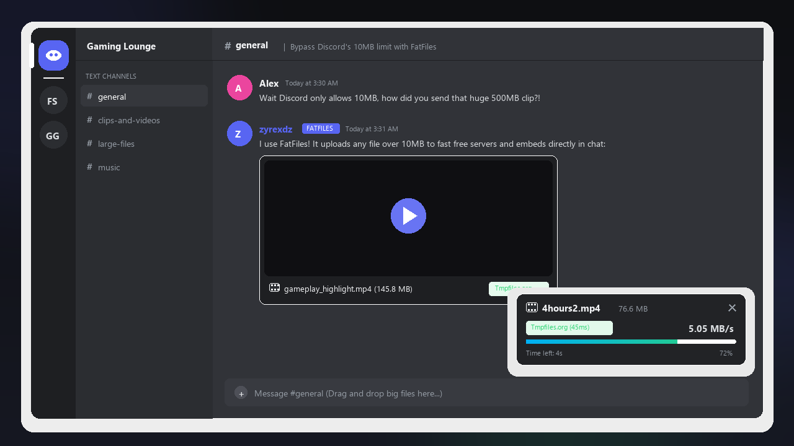
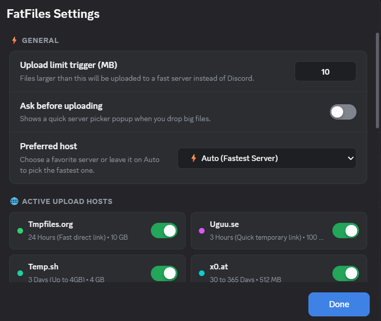

<div align="center">

# FatFiles

### Send big files on Discord without Nitro

[](https://betterdiscord.app/)
[](https://github.com/zyrexdz/FatFiles)
[](LICENSE)
[](https://github.com/zyrexdz/FatFiles)
[](https://github.com/zyrexdz/FatFiles/stargazers)

<br/>



<br/>

**FatFiles** is a BetterDiscord plugin that lets you send huge videos, zips, music, and documents past Discord's 25MB limit for free. Just drag and drop any file into chat like normal. The plugin automatically uploads it to the fastest free file host and puts a playable direct link right in your message box.

</div>

---

## ✨ Features

- 🚀 **Bypass Discords 25MB Limit**: Upload files up to 10GB without getting blocked.
- 🎯 **Auto Pick (Fastest Server)**: Checks latency to all enabled hosts and automatically uses the fastest server for your file.
- 🎬 **Direct Media Embeds**: Videos, songs, and images play right inside Discord natively.
- 📊 **Live Floating Upload Card**: Clean popup in the bottom right corner shows real-time upload speed, percentage, ETA, and a cancel button.
- 🎛️ **Pre Upload Modal**: Pick your favorite host with one click, or check the box to always auto-upload without asking.
- 🛠️ **8 Fast Free Hosts**: Gofile.io (10GB), Temp.sh (4GB), Litterbox (1GB), x0.at (1GB), Catbox (200MB), Uguu (128MB), Tmpfiles (100MB), and Segs.lol (100MB).

---

## Supported File Hosts

| Host | Max Size | Retention | Direct Player Embeds |
| :--- | :--- | :--- | :--- |
| **Gofile.io** | 10 GB | Active Cloud | 📄 Download Page |
| **Temp.sh** | 4 GB | 3 Days | ✅ Yes (Fast cloud storage) |
| **Litterbox** | 1 GB | Up to 72 Hours | 📄 Direct Download |
| **x0.at** | 1 GB | 3 to 100 Days | ✅ Yes (Long term storage) |
| **Catbox.moe** | 200 MB | Permanent | ✅ Yes (Direct media link) |
| **Uguu.se** | 128 MB | 3 Hours | ✅ Yes (Quick temporary link) |
| **Tmpfiles.org** | 100 MB | 24 Hours | ✅ Yes (High speed direct stream) |
| **Segs.lol** | 100 MB | Permanent | ✅ Yes (Direct video player) |


---

## 📥 How to Install (Quick Tutorial)

### Step 1: Download the Plugin
Download [`FatFiles.plugin.js`](https://raw.githubusercontent.com/zyrexdz/FatFiles/main/FatFiles.plugin.js) from this repository.

### Step 2: Open your BetterDiscord Plugins Folder
Open Discord, go to **User Settings** (the gear icon) ➔ **Plugins** ➔ click **Open Plugins Folder** at the top.

Or paste this path into your file manager:

- **Windows**:
  ```text
  %appdata%\BetterDiscord\plugins
  ```
- **macOS**:
  ```text
  ~/Library/Application Support/BetterDiscord/plugins
  ```
- **Linux**:
  ```text
  ~/.config/BetterDiscord/plugins
  ```

### Step 3: Move the File and Turn it On
1. Drag and drop `FatFiles.plugin.js` into that folder.
2. Go back to Discord and flip the switch next to **FatFiles** to enable it.

Done! You're ready to upload big files.

---

## 🎮 How to Use

1. **Drag & Drop Any Big File**: Drag any file over 10MB into any Discord channel or DM.
2. **Choose or Auto Pick**: A small popup will appear asking where you want to upload it (or leave it on **Auto Pick** for the fastest server).
3. **Watch the Progress**: A small card appears at the bottom right showing live upload speed and ETA.
4. **Send**: Once finished, the playable direct link is automatically put into your chat box!

---

## ⚙️ Settings & Options

Click the gear icon next to **FatFiles** in your BetterDiscord Plugins list to customize:

<br/>

<div align="center">
  
</div>

<br/>

- **Upload limit trigger (MB)**: Default is 10MB. Any file bigger than this triggers FatFiles.
- **Ask before uploading**: Toggle the host selection popup on or off.
- **Preferred host**: Set a default host or keep it on Auto.
- **Active upload hosts**: Turn individual hosts on or off based on your preference.
- **How to post links**:
  - `Chat Box Draft`: Put in message box so you can write a message first.
  - `Send Right Away`: Posts link straight to the channel automatically.
- **Direct media embeds**: Sends direct URLs for videos and audio so Discord embeds them natively.
- **Upload progress popup**: Displays the live floating card with speed, ETA, and cancel button.
- **Test server latency**: One click benchmark button to ping all enabled hosts.

---

## ❓ Frequently Asked Questions

<details>
<summary><strong>Do my friends need BetterDiscord or FatFiles to see my files?</strong></summary>
<br/>
No! Anyone in the chat can click the link, download the file, or watch the video directly inside Discord without needing any plugins.
</details>

<details>
<summary><strong>Can I cancel an upload if I picked the wrong file?</strong></summary>
<br/>
Yes! Click the ✕ button on the floating upload card in the bottom right corner to cancel anytime.
</details>

<details>
<summary><strong>What happens if a server goes down?</strong></summary>
<br/>
FatFiles has automatic fallback built in. If the chosen host is unreachable or has an error, FatFiles instantly tries the next fastest server.
</details>

---

## 📜 License

This project is licensed under the [MIT License](LICENSE).

<div align="center">
Made with ❤️ by <a href="https://github.com/zyrexdz">zyrexdz</a>
</div>
